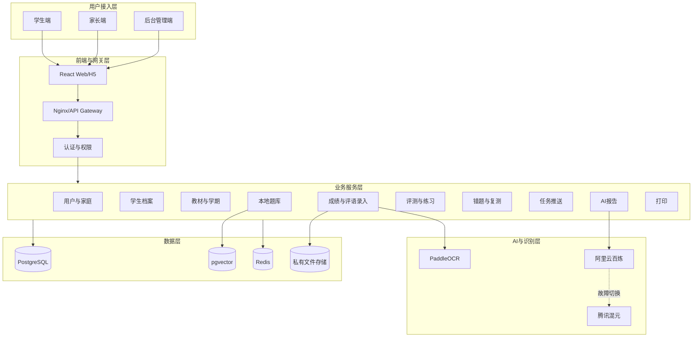
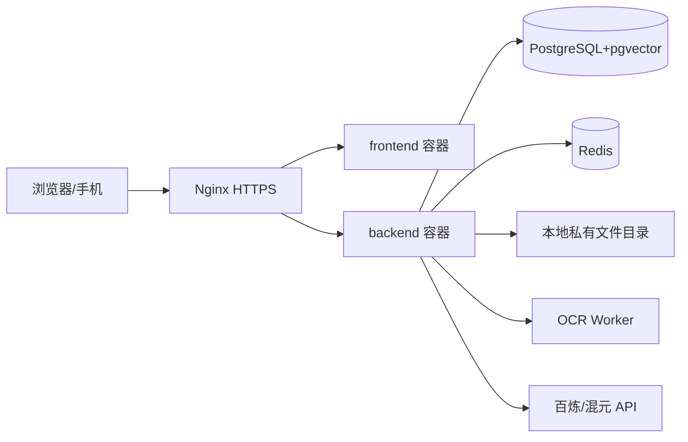
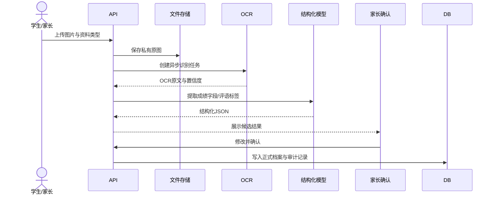
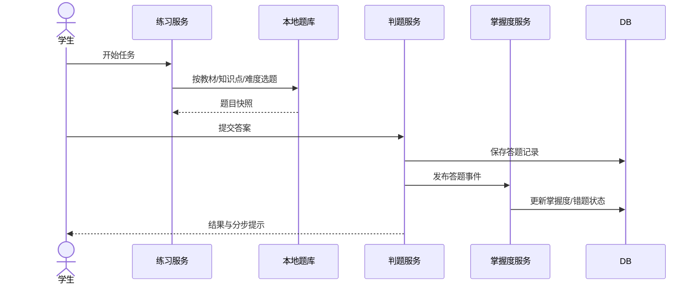

# 学迹智评概要设计说明书（HLD）

## 1. 设计目标

- 支持学生、家长、后台管理三角色。
- OCR、AI、题库、评测和报告形成解耦服务。
- MVP 可在一台腾讯云 Ubuntu 服务器上运行。
- 后续可平滑拆分为独立服务和云数据库。

## 2. 总体架构

## 3. 部署拓扑

MVP 单机部署：

## 4. 核心模块

### 4.1 前端

- 角色化路由：student、parent、admin。
- 统一设计系统和响应式布局。
- API 客户端、鉴权状态、错误处理和表单校验。
- MVP 先实现可运行工作台和关键流程页面。

### 4.2 API 网关

- Nginx 负责 TLS、静态资源、反向代理、上传限制和基础限流。
- FastAPI 提供 `/api/v1` REST 接口。
- OpenAPI 文档仅在管理网络或开发环境开放。

### 4.3 认证与权限

- JWT access token + refresh token。
- RBAC：student、parent、admin。
- 资源级授权：家长只能访问已绑定学生，学生只能访问本人。
- 敏感后台操作记录审计日志。

### 4.4 学生档案与教材

- 维护学生基础资料、家庭关系、学年、学期、行政年级和科目能力水平。
- 教材按科目配置，保留历史有效期。
- 当前进度必须记录来源、确认人和置信度。

### 4.5 OCR 录入

- 上传服务保存私有原图并创建 OCR 任务。
- OCR Worker 异步识别。
- 结构化服务提取成绩和评语标签。
- 家长确认后生成正式档案记录。
- 原图、原文、候选字段和修改历史相互关联。

### 4.6 本地题库

- 题目主体、选项、答案、解析与教材映射分离。
- 题目发布前必须通过审核。
- 题库检索按教材、知识点、难度、题型、状态和历史使用过滤。
- pgvector 用于相似题与重复题辅助，不作为唯一判断依据。

### 4.7 评测、练习与错题

- 练习计划生成后形成不可变题目快照，避免题目后续编辑影响历史。
- 客观题同步判分。
- 提交事件产生答题记录、错题记录和掌握度事件。
- 错题复测要求原题、同类题、变式题多阶段验证。

### 4.8 AI 报告

- 报告编排服务先从数据库计算事实指标，再调用模型生成受控文本。
- 提示词固定输出 JSON Schema。
- 主模型失败后切换备用模型。
- 所有结论必须保存证据引用和可信度等级。

## 5. 核心数据流

### 5.1 成绩/评语录入

### 5.2 练习闭环

## 6. 技术选型

- React + TypeScript + Vite：前端 SPA。
- FastAPI：高可读 API 与自动 OpenAPI。
- SQLAlchemy 2：ORM 与事务管理。
- PostgreSQL：主数据库。
- pgvector：相似内容检索。
- Redis：缓存、幂等键、限流和异步任务队列。
- PaddleOCR：本地 OCR。
- Docker Compose：MVP 编排。

## 7. 安全设计

- 密码哈希、短期 access token、refresh token 轮换。
- 上传文件按随机对象键保存，禁止使用原始文件名直接访问。
- 文件扩展名、MIME、大小和病毒扫描校验。
- AI 调用前删除不必要的姓名、学校和联系方式。
- 后台敏感字段默认脱敏。
- 数据删除采用申请—确认—执行—审计流程。

## 8. 可扩展性

达到以下条件时拆分服务：

- OCR 队列持续积压：独立 OCR Worker 集群。
- 报告生成延迟明显：独立 AI 编排服务。
- 题库达到百万级且复杂检索增多：增加只读副本与搜索引擎。
- 文件超过单机容量：迁移腾讯 COS。
- 数据库负载超过单机：迁移云 PostgreSQL。
