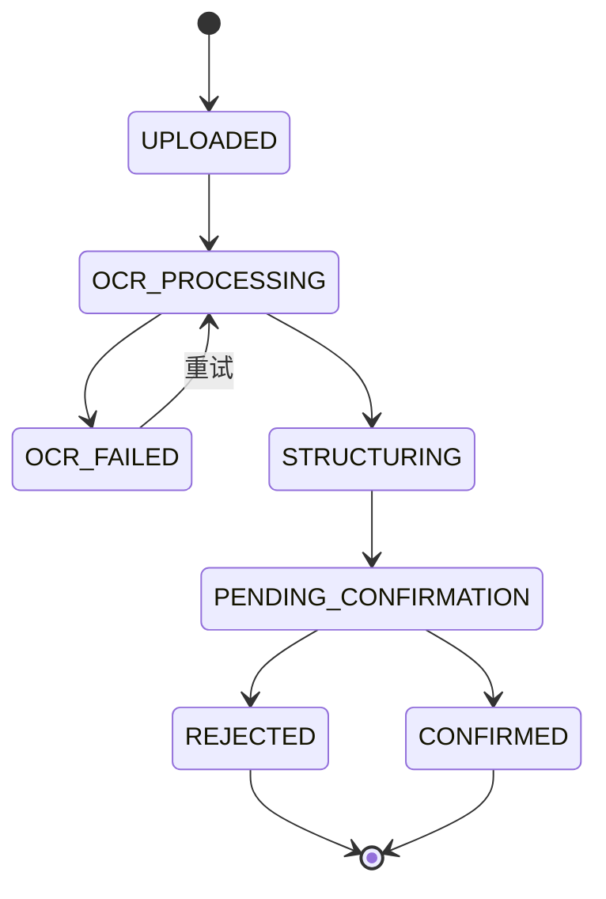
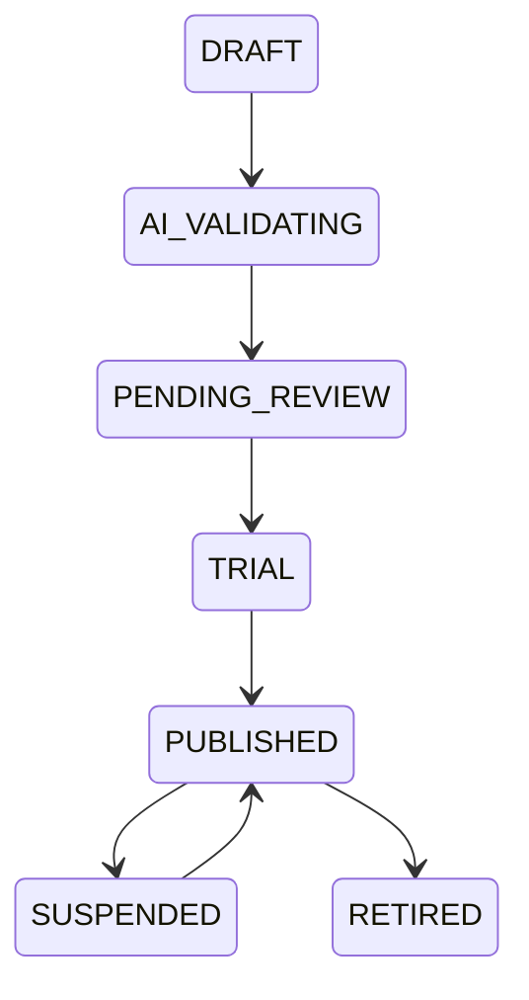

# 学迹智评详细设计说明书（LLD）

## 1. 后端分层

```text
backend/app/
├── api/              # 路由与请求响应模型
├── core/             # 配置、安全、日志、异常
├── db/               # 会话、基类、迁移入口
├── models/           # SQLAlchemy 模型
├── schemas/          # Pydantic DTO
├── repositories/     # 数据访问
├── services/         # 业务逻辑
├── integrations/     # OCR/AI/存储供应商适配器
├── workers/          # 异步任务
└── main.py
```

路由层不得直接执行复杂 SQL 或调用外部供应商；业务规则进入 service，持久化进入 repository，外部 API 进入 adapter。

## 2. 前端分层

```text
frontend/src/
├── api/              # HTTP 客户端与接口函数
├── components/       # 通用组件
├── features/         # 按业务模块组织
├── layouts/          # 学生/家长/后台布局
├── pages/            # 路由页面
├── stores/           # 会话与页面状态
├── types/            # TypeScript 类型
├── utils/            # 格式化与校验
└── main.tsx
```

## 3. 身份认证设计

### 登录流程

1. 客户端提交账号和密码。
2. 后端校验密码哈希和账号状态。
3. 返回短期 access token 与 refresh token。
4. refresh token 只保存哈希值，并绑定设备会话。
5. 每次刷新后轮换 refresh token，旧令牌失效。

### 权限矩阵

| 资源 | 学生 | 家长 | 管理员 |
|---|---|---|---|
| 本人学习任务 | 读/作答 | 查看绑定学生 | 管理异常 |
| 正式成绩 | 只读 | 读写绑定学生 | 受控查看 |
| 待确认资料 | 上传/查看本人 | 确认绑定学生 | 技术处理 |
| 题库练习 | 使用 | 选择并推送 | 维护与审核 |
| AI报告 | 学生版 | 家长版 | 模板与质量 |
| 系统配置 | 无 | 无 | 读写 |

## 4. 资料上传状态机



约束：

- 学生上传时 `confirmed_by` 必须是其绑定家长。
- 成绩日期、科目、分数为关键字段，低置信度必须提示。
- `CONFIRMED` 后修改必须创建 revision，不允许静默覆盖。

## 5. 题库发布状态机



只有 `PUBLISHED` 题目可进入正式评测。AI 生成题必须经过答案校验和人工审核。

## 6. 练习计划生成

输入：学生、科目、教材、已学知识点、掌握度、错题、可用时长、任务类型。

伪代码：

```text
candidate = published_questions
  .match(subject, textbook, learned_knowledge_points)
  .exclude(recently_seen, disputed, out_of_scope)

weights = weakness * recency * forgetting_risk * parent_priority * quality
questions = stratified_sample(candidate, difficulty_ratio, question_type_ratio)
freeze_snapshot(questions)
return practice_session
```

默认推荐配比：

- 当前薄弱知识点 40%
- 系统错题复测 25%
- 当前课堂同步 20%
- 已掌握知识保持 15%

## 7. 判题设计

### 客观题

- 单选：标准化选项编码比较。
- 多选：集合完全相等；可配置是否部分得分。
- 判断：布尔值比较。
- 填空：MVP 支持规范化字符串、数值容差和多个等价答案。

### 提示策略

1. 第一次错误：指出检查方向，不显示答案。
2. 第二次错误：显示方法提示。
3. 第三次错误：显示分步解析并记录提示依赖。

## 8. 错题状态转换

```text
ANSWER_WRONG -> NEW
NEW -> LEARNING（查看知识卡/解析）
LEARNING -> WAIT_RETRY
WAIT_RETRY -> ORIGINAL_PASSED / RETRY_FAILED
ORIGINAL_PASSED -> SIMILAR_PASSED
SIMILAR_PASSED -> VARIANT_PASSED
VARIANT_PASSED -> STABLE_MASTERED
STABLE_MASTERED -> SUSPECTED_FORGOTTEN（时间衰减或遗忘复测失败）
```

## 9. 掌握度计算

MVP 使用可解释加权模型，不直接用大模型给分。

```text
score = 0.30 * recent_accuracy
      + 0.15 * difficulty_adjusted_accuracy
      + 0.15 * similar_question_accuracy
      + 0.15 * variant_question_accuracy
      + 0.10 * retest_accuracy
      + 0.05 * time_efficiency
      + 0.05 * independence
      + 0.05 * stability
      - forgetting_decay
```

`independence` 由提示次数反向计算。数据少于最小题量时状态必须为 `INSUFFICIENT_DATA`。

## 10. AI报告生成流程

1. 锁定分析时间范围。
2. 聚合成绩、评语、答题、错题、任务和时长数据。
3. 生成事实层 JSON，不允许模型计算关键统计。
4. 脱敏后调用主 AI。
5. 按 JSON Schema 校验输出。
6. 失败时重试一次，再切换备用 AI。
7. 保存模型、提示词、事实快照、输出、证据和耗时。
8. 模型输出不得直接修改掌握度和正式成绩。

## 11. 外部服务适配器

```python
class AIProvider(Protocol):
    async def generate_json(self, prompt: str, schema: dict) -> dict: ...

class OCRProvider(Protocol):
    async def recognize(self, file_path: str) -> OCRResult: ...
```

实现：`BailianProvider`、`HunyuanProvider`、`PaddleOCRProvider`。业务层只依赖协议。

## 12. 幂等与重试

- 上传：客户端生成 idempotency key。
- 答题提交：`session_id + question_id + attempt_no` 唯一。
- OCR：同一任务状态为处理中时禁止重复执行。
- AI报告：同一学生、报告类型、数据快照哈希唯一。
- 外部调用采用指数退避，最多两次；超时后记录失败原因。

## 13. 日志与审计

业务日志不得记录密码、Token、API Key、身份证、完整原图 URL 或完整未脱敏 AI 请求。

审计事件至少包括：登录失败、家庭绑定变更、正式成绩修改、资料确认、题目发布/下架、报告生成、敏感数据导出和删除。

## 14. 错误码

| 错误码 | 含义 |
|---|---|
| AUTH_001 | 登录凭证错误 |
| AUTH_003 | 无权访问该学生 |
| PROFILE_001 | 学生档案不存在 |
| INGEST_002 | 上传文件类型不支持 |
| INGEST_005 | 资料仍在处理中 |
| QUESTION_004 | 题目未发布或已下架 |
| PRACTICE_003 | 重复提交 |
| AI_001 | 主模型调用失败 |
| AI_002 | 所有模型不可用 |
| DATA_001 | 数据不足，无法生成确定结论 |
