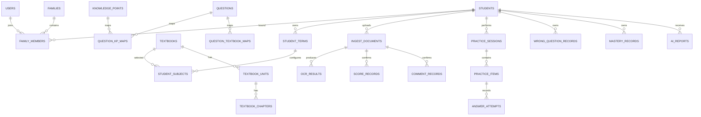

# 学迹智评数据库设计说明书

## 1. 设计原则

- PostgreSQL 为唯一业务真相源。
- 题目主体与教材映射分离。
- 正式成绩、评语和报告使用版本化记录，不静默覆盖。
- 多租户边界以家庭与学生关系为主，所有查询必须带资源授权条件。
- 时间统一使用 UTC 存储，前端按用户时区展示。
- 主键使用 UUID；大规模事件表可使用 bigint 或 UUIDv7。

## 2. 主要实体关系

## 3. 核心表

### 3.1 users

| 字段 | 类型 | 约束 | 说明 |
|---|---|---|---|
| id | uuid | PK | 用户ID |
| account | varchar(128) | unique, not null | 手机或邮箱 |
| password_hash | varchar(255) | not null | 密码哈希 |
| role | varchar(20) | not null | student/parent/admin |
| status | varchar(20) | not null | active/locked/deleted |
| display_name | varchar(64) | not null | 昵称 |
| created_at | timestamptz | not null | 创建时间 |
| updated_at | timestamptz | not null | 更新时间 |

索引：`unique(account)`、`index(role,status)`。

### 3.2 families

| 字段 | 类型 | 约束 | 说明 |
| id | uuid | PK | 家庭ID |
| name | varchar(64) | not null | 家庭名称 |
| primary_guardian_user_id | uuid | FK users | 主监护人 |
| created_at | timestamptz | not null | 创建时间 |

### 3.3 students

| 字段 | 类型 | 约束 | 说明 |
| id | uuid | PK | 学生ID |
| user_id | uuid | nullable FK users | 学生登录账号 |
| family_id | uuid | FK families | 所属家庭 |
| nickname | varchar(64) | not null | 昵称 |
| birth_month | date | nullable | 只存月份可减少敏感度 |
| region_code | varchar(20) | nullable | 地区编码 |
| school_name | varchar(128) | nullable | 学校，可选 |
| school_system | varchar(20) | not null | 6-3/5-4/other |
| enrollment_year | smallint | nullable | 入学年份 |
| status | varchar(20) | not null | active/archived |
| created_at | timestamptz | not null | 创建时间 |

### 3.4 family_members

| 字段 | 类型 | 约束 | 说明 |
| family_id | uuid | FK | 家庭 |
| user_id | uuid | FK | 用户 |
| student_id | uuid | nullable FK | 绑定学生 |
| member_role | varchar(20) | not null | guardian/student |
| permission_level | varchar(20) | not null | primary/manage/view |
| created_at | timestamptz | not null | 创建时间 |

唯一键：`(family_id,user_id,student_id,member_role)`。

### 3.5 academic_terms

| 字段 | 类型 | 说明 |
|---|---|---|
| id | uuid | 学期ID |
| school_year | varchar(20) | 如2026-2027 |
| term_no | smallint | 1或2 |
| start_date | date | 开始日期 |
| end_date | date | 结束日期 |
| status | varchar(20) | planned/active/archived |

### 3.6 student_terms

| 字段 | 类型 | 说明 |
|---|---|---|
| id | uuid | 配置ID |
| student_id | uuid | 学生 |
| academic_term_id | uuid | 学期 |
| administrative_grade | smallint | 行政年级 |
| archived_at | timestamptz | 归档时间 |
| snapshot_json | jsonb | 学期归档快照 |

唯一键：`(student_id,academic_term_id)`。

### 3.7 subjects

`id, code, name, stage, enabled`。MVP 默认数学、语文、英语、科学。

### 3.8 textbooks

| 字段 | 类型 | 说明 |
|---|---|---|
| id | uuid | 教材ID |
| subject_id | uuid | 科目 |
| publisher | varchar(128) | 出版社 |
| version_name | varchar(128) | 版本 |
| revision_year | smallint | 修订年份 |
| curriculum_standard | varchar(64) | 课程标准版本 |
| grade | smallint | 年级 |
| volume | varchar(20) | 上/下/全一册 |
| region_scope | jsonb | 适用地区 |
| status | varchar(20) | draft/published/retired |

唯一建议：`subject_id,publisher,version_name,revision_year,grade,volume`。

### 3.9 student_subjects

| 字段 | 类型 | 说明 |
|---|---|---|
| id | uuid | 配置ID |
| student_term_id | uuid | 学生学期 |
| subject_id | uuid | 科目 |
| textbook_id | uuid | 当前教材 |
| ability_grade | numeric(3,1) | 实际能力年级 |
| current_chapter_id | uuid | 当前章节 |
| progress_source | varchar(20) | parent/student/ocr/estimated |
| progress_confidence | numeric(5,2) | 置信度 |
| confirmed_by | uuid | 确认人 |
| confirmed_at | timestamptz | 确认时间 |

### 3.10 knowledge_points

| 字段 | 类型 | 说明 |
|---|---|---|
| id | uuid | 知识点ID |
| subject_id | uuid | 科目 |
| code | varchar(64) | 稳定编码 |
| name | varchar(128) | 名称 |
| parent_id | uuid | 父知识点 |
| cognitive_level | varchar(30) | 识记/理解/应用/迁移 |
| prerequisites | jsonb | 前置知识点ID列表 |
| status | varchar(20) | 状态 |

### 3.11 ingest_documents

| 字段 | 类型 | 说明 |
|---|---|---|
| id | uuid | 文档ID |
| student_id | uuid | 学生 |
| uploader_user_id | uuid | 上传人 |
| document_type | varchar(30) | score/comment/evaluation/textbook/progress |
| file_key | varchar(255) | 私有存储键 |
| file_hash | varchar(64) | 去重哈希 |
| status | varchar(30) | 上传/OCR/待确认/已确认/驳回 |
| idempotency_key | varchar(64) | 幂等键 |
| created_at | timestamptz | 创建时间 |
| confirmed_by | uuid | 确认人 |
| confirmed_at | timestamptz | 确认时间 |

索引：`student_id,created_at desc`、`file_hash`、`status`。

### 3.12 ocr_results

`id, document_id, provider, provider_task_id, raw_text, blocks_json, confidence, structured_json, error_code, started_at, completed_at`。

### 3.13 score_records

| 字段 | 类型 | 说明 |
|---|---|---|
| id | uuid | 成绩ID |
| student_id | uuid | 学生 |
| source_document_id | uuid | 来源资料 |
| subject_id | uuid | 科目 |
| exam_name | varchar(128) | 考试名称 |
| exam_type | varchar(30) | 小测/单元/期中/期末等 |
| exam_date | date | 日期 |
| score | numeric(8,2) | 原始分 |
| full_score | numeric(8,2) | 满分 |
| grade_value | varchar(30) | 原始等级 |
| class_average | numeric(8,2) | 班级均分 |
| class_rank | integer | 班级排名 |
| grade_rank | integer | 年级排名 |
| scope_json | jsonb | 考试范围 |
| version | integer | 版本 |
| confirmed_by | uuid | 确认人 |
| created_at | timestamptz | 创建时间 |

### 3.14 comment_records

`id, student_id, source_document_id, comment_date, original_text, structured_tags_json, ai_confidence, confirmed_by, version, created_at`。

`structured_tags_json` 每项包含：dimension、value、polarity、evidence_text、confidence、confirmed。

### 3.15 questions

| 字段 | 类型 | 说明 |
|---|---|---|
| id | uuid | 题目ID |
| code | varchar(64) | 可读编号 |
| subject_id | uuid | 科目 |
| stem | text | 题干 |
| question_type | varchar(30) | 题型 |
| difficulty | numeric(3,2) | 0-1 |
| cognitive_level | varchar(30) | 认知层级 |
| estimated_seconds | integer | 预计用时 |
| answer_json | jsonb | 标准答案 |
| explanation | text | 完整解析 |
| hints_json | jsonb | 分步提示 |
| common_errors_json | jsonb | 常见错误 |
| source_type | varchar(30) | self/licensed/ai/public |
| copyright_json | jsonb | 授权信息 |
| status | varchar(30) | draft/review/trial/published等 |
| version | integer | 版本 |
| embedding | vector | 相似检索向量 |
| created_at | timestamptz | 创建时间 |

### 3.16 question_options

`id, question_id, option_key, content, sort_order`。

### 3.17 question_kp_maps

`question_id, knowledge_point_id, relation_type(primary/secondary/prerequisite), weight`。

### 3.18 question_textbook_maps

`question_id, textbook_id, unit_id, chapter_id, lesson_id, suitability, verified_by, verified_at`。

### 3.19 practice_sessions

`id, student_id, task_id, session_type, subject_id, status, planned_seconds, started_at, submitted_at, score_summary_json, generation_rule_json`。

### 3.20 practice_items

`id, session_id, question_id, question_version, snapshot_json, sort_order, knowledge_point_id, purpose`。

`snapshot_json` 固化题干、选项、答案引用版本和规则。

### 3.21 answer_attempts

`id, session_id, practice_item_id, student_id, attempt_no, answer_json, is_correct, score, duration_seconds, hint_count, submitted_at, device_json`。

唯一键：`session_id,practice_item_id,attempt_no`。

### 3.22 wrong_question_records

`id, student_id, question_id, knowledge_point_id, first_wrong_at, last_wrong_at, wrong_count, state, next_review_at, latest_attempt_id, version`。

### 3.23 mastery_records

`id, student_id, knowledge_point_id, score, state, evidence_count, model_version, components_json, last_evaluated_at`。

唯一键：`student_id,knowledge_point_id`。

### 3.24 learning_tasks

`id, student_id, created_by, task_type, title, content_json, due_at, estimated_minutes, reward_points, status, completed_at`。

### 3.25 ai_reports

| 字段 | 类型 | 说明 |
|---|---|---|
| id | uuid | 报告ID |
| student_id | uuid | 学生 |
| report_type | varchar(30) | student/parent/weekly/term |
| period_start/end | date | 数据范围 |
| facts_snapshot_json | jsonb | 事实输入快照 |
| data_hash | varchar(64) | 幂等与追踪 |
| provider | varchar(30) | 供应商 |
| model | varchar(64) | 模型 |
| prompt_version | varchar(30) | 提示词版本 |
| output_json | jsonb | 结构化报告 |
| evidence_json | jsonb | 证据引用 |
| status | varchar(20) | generating/completed/failed |
| created_at | timestamptz | 创建时间 |

### 3.26 audit_logs

`id, actor_user_id, action, resource_type, resource_id, before_json, after_json, ip_hash, user_agent_hash, created_at`。

## 4. 分区与归档建议

达到规模后按月分区：`answer_attempts`、`audit_logs`、`learning_events`。学期归档快照保留长期，原始图片按隐私策略自动过期。

## 5. 备份

- 每日逻辑备份，保留7天。
- 每周完整备份，保留4周。
- 每月恢复演练。
- 数据库备份和原始图片备份不得只放在同一块系统盘。
