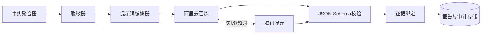
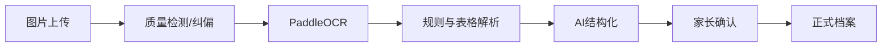

# 学迹智评 AI 与 OCR 设计说明书

## 1. 设计边界

AI 负责文本结构化、受控报告生成、学习建议和题目辅助标注；不负责修改正式成绩、不单独决定知识点掌握度、不在 MVP 中识别整张试卷或自动提取纸质错题。

OCR 负责成绩单、教师评语、学校评价、教材封面与目录等有限资料的文字和表格提取。所有关键结果必须人工确认。

## 2. AI 服务架构



## 3. AI 使用场景

### 3.1 教师评语结构化

输入：OCR 原文、资料日期、科目（如有）、有限学生上下文。

输出 JSON：

```json
{
  "original_summary": "课堂认真，应用题审题需加强",
  "tags": [
    {
      "dimension": "class_attention",
      "value": "good",
      "polarity": "positive",
      "evidence_text": "课堂听讲认真",
      "confidence": 0.96
    }
  ],
  "uncertain_fields": [],
  "safety_notes": []
}
```

要求：不得虚构原文没有出现的教师观点；每个标签必须给出证据句。

### 3.2 成绩资料结构化

模型只对 OCR 文本进行字段归一化和候选关联。分数、满分、排名等关键数值优先使用规则和表格定位，模型不得在数值缺失时猜测。

### 3.3 学生版报告

语气：具体、友好、少标签化、强调可执行小目标。

固定结构：

- analysis_scope
- recent_progress
- strengths
- current_challenges
- evidence
- next_tasks
- learning_tip
- encouragement
- insufficient_data
- next_update_condition

### 3.4 家长版报告

固定结构：

- executive_summary
- data_quality
- school_results
- teacher_comments
- local_question_bank_performance
- time_and_execution
- dimensions
- strengths
- problems
- possible_causes
- two_week_actions
- parent_communication_advice
- risks_and_limits
- reevaluation_conditions

### 3.5 题目辅助能力

允许：题目知识点候选、难度候选、常见错误候选、变式题草稿、答案复核。

限制：AI 生成题必须经过程序求解/答案校验和人工审核，不能直接发布。

## 4. 事实层设计

报告调用模型前，后端生成 `facts_snapshot`：

```json
{
  "period": {"start": "2026-07-01", "end": "2026-07-14"},
  "data_counts": {"scores": 3, "comments": 2, "answers": 168},
  "scores": [{"subject": "math", "score_rate": 0.86, "date": "2026-07-14"}],
  "comment_evidence": [{"dimension": "class_attention", "value": "good"}],
  "practice": {
    "math_basic_accuracy": 0.91,
    "math_application_accuracy": 0.58,
    "hint_dependency": 0.12
  },
  "task_execution": {"completion_rate": 0.86, "effective_minutes": 166},
  "mastery": [{"kp": "fraction_application", "score": 0.62}],
  "data_limits": ["writing_samples_insufficient"]
}
```

所有百分比由后端计算，模型只负责解释和表达。

## 5. 结论可信度

AI 输出每项结论必须包含：

- `level=fact`：直接来源于成绩或答题记录。
- `level=high_confidence`：至少两个独立数据来源一致。
- `level=possible`：证据有限，只能提出可能性。
- `level=insufficient_data`：明确不做判断。

禁止将单次成绩下降解释为态度、智力、心理或家庭问题。

## 6. 提示词治理

- 提示词存放于版本化配置，不硬编码在路由中。
- 每次报告保存 prompt_version、模型、供应商和事实快照哈希。
- 提示词要求只使用输入事实、引用证据 ID、严格输出 JSON。
- 系统提示中明确未成年人保护、非诊断、非医疗、非心理标签化要求。

## 7. 模型路由

默认路由：

1. 结构化任务：百炼低成本模型。
2. 学生即时鼓励：模板优先，必要时低成本模型。
3. 学生周报：百炼中等模型。
4. 家长综合报告：百炼较强模型。
5. 主服务超时、限流或连续错误：腾讯混元备用。

降级策略：

- AI 全部不可用时，返回规则化统计报告，不阻断答题和档案功能。
- 报告状态显示“AI解读暂不可用”，事实数据仍可查看。

## 8. 成本控制

- 只发送结构化事实，不发送全部历史原文。
- 评语先做一次结构化，后续报告复用标签。
- 按 `student + report_type + data_hash` 缓存报告。
- 即时鼓励优先模板化。
- 设置单用户、单日和全局 Token 上限。
- 后台监控输入/输出 Token、失败率和单报告成本。

## 9. OCR 架构



## 10. OCR 处理流程

1. 校验 JPEG/PNG/PDF、大小、页数和 MIME。
2. 计算文件哈希并检测重复。
3. 图像旋转、裁切、去噪、对比度增强。
4. PaddleOCR 输出文字块、坐标和置信度。
5. 按资料类型运行规则解析器。
6. 必要时调用 AI 结构化。
7. 关键字段置信度低于阈值时标红。
8. 家长确认并保存修订记录。

## 11. OCR 置信度规则

- 分数、满分、日期、排名：建议阈值 0.95。
- 印刷体普通文本：0.90。
- 手写评语：不因整体置信度高而自动确认。
- 出现数值冲突、分数大于满分、排名异常时强制人工检查。

## 12. 隐私与安全

- OCR 和 AI 任务使用内部文档 ID，不使用学生姓名作为文件名。
- 外部模型请求移除手机号、学校详细地址、家庭联系方式等无关信息。
- 原图使用私有存储；访问 URL 短期有效。
- 开发和测试使用虚构或脱敏数据。
- 不把真实学生资料写入提示词日志和错误追踪平台。

## 13. AI 质量评估

评语结构化指标：字段准确率、标签准确率、证据匹配率、家长修改率。

报告指标：事实一致率、证据引用完整率、无依据结论率、格式通过率、家长有用性评分。

题目辅助指标：知识点标注准确率、答案一致率、重复率、争议率和人工退回率。

## 14. 人工审核

- 正式成绩和评语必须由家长确认。
- AI 生成题必须由题库审核员确认。
- 高风险或疑似异常报告可进入后台质量队列，但运营人员默认只查看脱敏事实。
